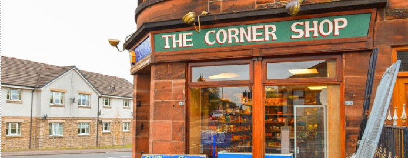

# NewEyes - Умни очила за незрящи хора

# Автор

Иван Цветков - разработил проекта  
&emsp;• Username: gonogo, E-mail: i.tsvetkovbg@gmail.com

# Примери
1.) Четене на текст от Български и Английски език 
(Допълнение: Ориентацията на снимките не е от значение, софтуера засича неправилната ориентация и изправя или обръща снимката)

  

  

  

  

# Справяне с неправилната ориентация на текста

  

# Сканиране на касови бележки

      
# Разпознаване на обекти и тяхната позиция в пространството

  

Съответно, след цялостната обработка, разпознаването на обектите и превода на български език, през говорителите на устройството гласовият асистент изговаря съответното съобщение 

 

# Интерактивна помощ от друг човек чрез камерата на очилата 

 

Опцията представлява видеочат, чрез който незрящият бива  
навигиран от друг човек (познат/приятел/роднина)  

...
