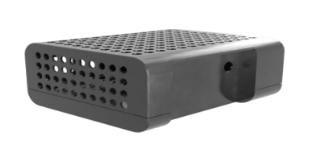
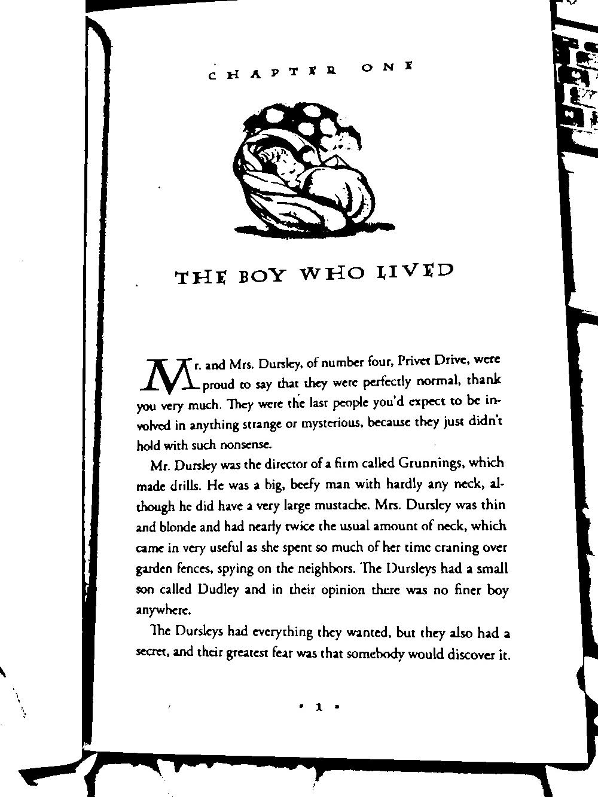
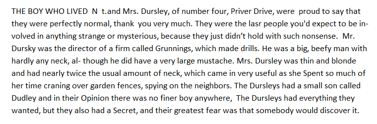

# NewEyes - Умни очила за незрящи хора

# Автор

Иван Цветков - разработил проекта  
&emsp;• Username: gonogo, E-mail: i.tsvetkovbg@gmail.com

# Примери

## Screenshots

  
   

## Готов продукт

  
   

## Четене на текст от Български и Английски език  
(Допълнение: Ориентацията на снимките не е от значение, софтуера 
засича неправилната ориентация и изправя или обръща снимката)

  

## Четене на печатен текст  

  

  

## Пример за справяне с неправилната ориентация на текста

  

## Четене на текст в необичайна среда

  

## Сканиране на касови бележки

      

## Разпознаване на обекти и тяхната позиция в пространството
Съответно, след цялостната обработка, разпознаването на обектите и превода на български език,
през говорителите на устройството или през свързаните към устройството слушалки, 
съответното съобщение се изговаря през говорителите или през слушалките в ухото на незрящия човек.

 

 

      

## Интерактивна помощ от друг човек чрез камерата на очилата 

Опцията представлява видеочат, чрез който незрящият бива  
навигиран от друг човек (познат/приятел/роднина), като връзката
се осъществява посредством платформата за видео чат Duo 

      

## Разпознаване на главен цвят от снимка
https://user-images.githubusercontent.com/97058791/152701536-6b37c342-0eb0-4af8-9801-c10c8d0b1d24.mp4

      

## Разпознаване на баркод и QR код

      

## Отличия

